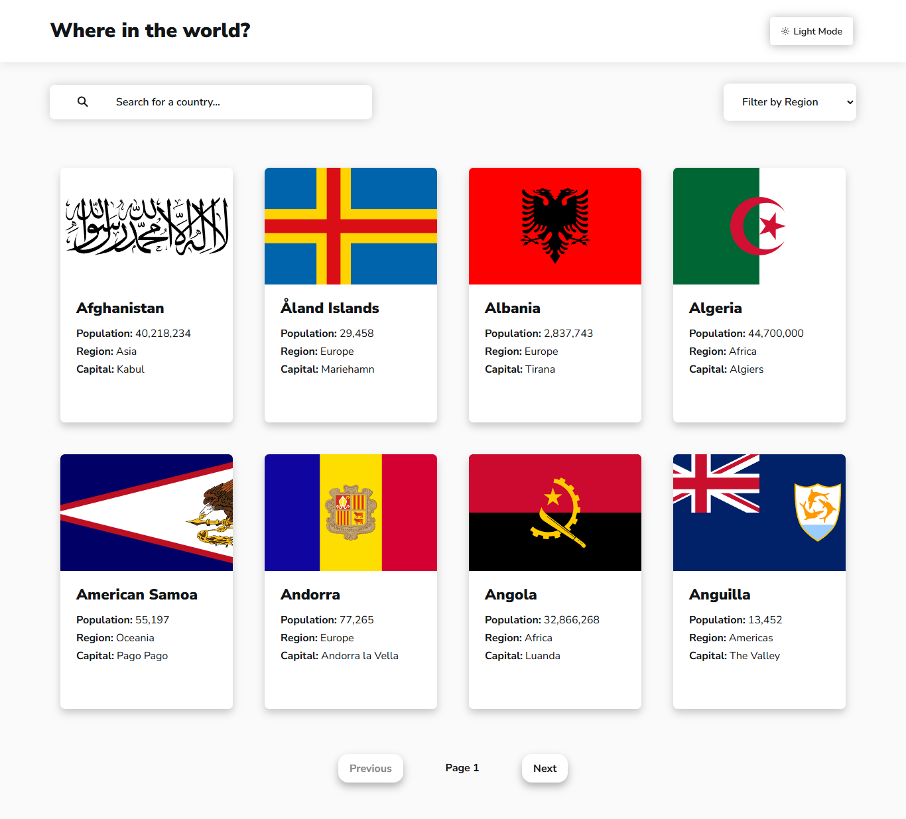
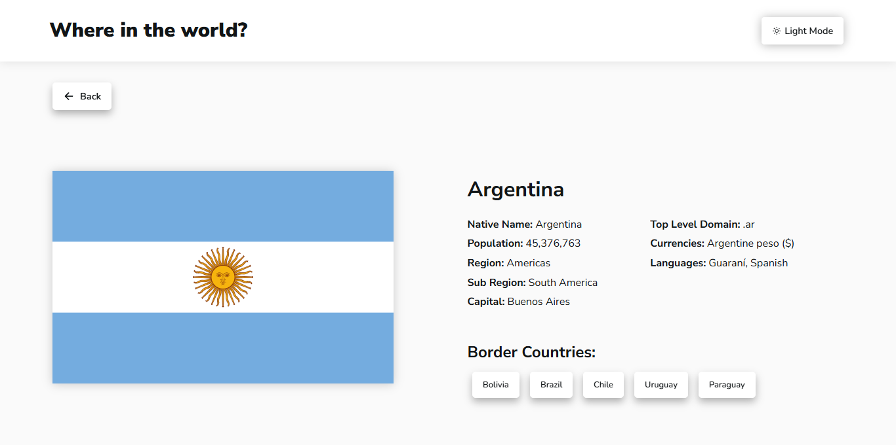

# 🔍 REST Countries API 
This project is a solution for the [REST Countries API challenge on Frontend Mentor](https://www.frontendmentor.io/challenges/rest-countries-api-with-color-theme-switcher-5cacc469fec04111f7b848ca). 

## Table of contents
- [🔍 REST Countries API](#-rest-countries-api)
  - [Table of contents](#table-of-contents)
  - [Overview](#overview)
    - [✨ Main Features](#-main-features)
    - [📷 Screenshots](#-screenshots)
    - [🌐 Online Demo](#-online-demo)
  - [My process](#my-process)
    - [🛠️ Technologies Used](#️-technologies-used)
    - [📌 Challenges Faced](#-challenges-faced)
    - [🚀 Future Improvements](#-future-improvements)
    - [📚 Useful resources](#-useful-resources)

## Overview
This project is a web application that allows users to explore information about different countries. It fetches data from the [REST Countries API](https://restcountries.com/) to display details such as the country's name, population, capital, and borders. Users can search for countries using an input field, filter countries by region, and view detailed information about each country on a separate page. Additionally, the app features a theme switcher to toggle between light and dark modes, improving the user experience across different environments.

### ✨ Main Features
1. **Explore All Countries:**
   - See all countries from the API on the homepage
2. **Country Details:**
   - Displays details about each country, such as population, region, subregion, capital, and neighboring countries.
3. **Border Country Navigation:**
   - Click through to the border countries on the detail page.
4. **Interactive Search:**
   - Allows searching countries by name using an `input` field.
5. **Region Filter:**  
   - Filters the country list by region (continent).
6. **Light/Dark Mode:**  
   - Switches between light and dark modes for a better user experience.

### 📷 Screenshots


<br>
<br>


### 🌐 Online Demo
You can explore the project on **[GitHub Pages](https://agustinchazarreta.github.io/REST-Countries-API/)**.
Este es el primer párrafo.


## My process

### 🛠️ Technologies Used
- **HTML5:** Semantic structure of the application.  
- **CSS3:** Responsive design using Flexbox, Grid, and custom animations.  
- **JavaScript (ES6+):** Dynamic interaction with the REST API and event handling.  
- **Mobile-first workflow:** Initial focus on mobile devices, optimizing the experience on small screens before scaling it to larger resolutions.

### 📌 Challenges Faced
Throughout this project, I gained valuable insights into both frontend development and working with APIs. Some key takeaways include:

- **Event Handling**: I learned how to manage user interactions, such as search combined filtering (by region and name) and country selection, by handling events effectively. I gained a deeper understanding of JavaScript event listeners and how to update the DOM dynamically based on user input.

Example of event handling for country search:
```js
const filterCountry = document.querySelector(".filter-country");
filterCountry.addEventListener("change", () => {
  const newRegion = filterCountry.value;
  // Update API URL based on selected region
});
```

---
- **Interacting with APIs**: One of the most important skills I learned was how to fetch data from an external API (REST Countries API) using fetch in JavaScript and displaying that data dynamically. I also learned how to make GET requests to the API to retrieve different data for each country. This helped me understand asynchronous JavaScript and how to manage data flows in a modern web app

Example of fetching data:
```js
fetch(`https://restcountries.com/v3.1/all`)
  .then((response) => response.json())
  .then((data) => {
    allCountries = data;
  });
```

---
- **Toggle between light and dark modes**: I implemented a feature allowing users to switch between light and dark themes. This was a fun challenge that required managing CSS custom properties and dynamically changing styles with JavaScript.

Example of toggling the theme:
```js
darkModeToggle.addEventListener('click', () => {
  body.classList.toggle('dark-mode');
});
```

### 🚀 Future Improvements
- Optimizing performance when handling large volumes of data.  
- Adding multilingual support to the interface. 

### 📚 Useful resources
- [Responsively App](https://responsively.app) - This helped me use responsive design because it allowed me to have precise control over the page's style, effectively adapting it to different screen sizes.
- [Postman](https://www.postman.com) - Using Postman made it easy to visualize the API's content, allowing for quick and clear inspection of the data being returned.